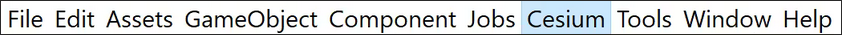

# Documentatie

## Instalatie
Om Cesium te runnen is een computer met windows nodig. (Mac is niet getest en linux werkt niet.)

**Stappen**
- Instaleer '[Unity Hub](https://docs.unity.com/en-us/hub/install-hub)' en installeer daarna de LTS (2023) versie van de editor in unity hub.
- Maak een nieuw project met de `3D (URP)` template. Geef je project een naam (en kies een bestandlocatie) en druk op create project. Wacht totdat deze klaar is.
- Als de editor is geladen zie je boven in: `file` `edit` etc. staan. Ga eerst naar `edit` -> `project settings` -> `package manager`. Hierna maak je een nieuwe `Scoped Registry` met de volgende gegevens:
  - Name: Cesium
  - URL: https://unity.pkg.cesium.com
  - Scope(s): com.cesium.unity
- Sluit dit menu
- Hierna moet de package geinstalleerd worden. Ga hiervoor naar `window` -> `Package Manager`. Druk hierna op de `packages` dropdown en druk op `My Registries`. Klik op Cesium en installeer deze.

- Ga naar de `Cesium` tab en druk op `Cesium`. Nu komt er een window van cesium aan de linker kant. Je kunt nu connecten met cesium (gratis).

- Maak een georefrence

## Bronnen

- https://docs.unity.com/en-us/hub/install-hub
- https://cesium.com/learn/unity/unity-quickstart/

### Lagen
- 

## Woorden
- LTS = Long term support
